# JetpackMovieKMP

一個使用 **Kotlin Multiplatform** 打造的跨平台電影瀏覽 App，資料來源為 [TMDB API](https://www.themoviedb.org/documentation/api)，同時支援 **Android**（Jetpack Compose）與 **iOS**（SwiftUI）。網路、資料庫、偏好設定、Repository、UseCase 等業務邏輯集中在 `shared/*` 模組共用，兩個平台各自實作原生 UI。

## Medium

📖 [Android工程師實作KMP+iOS的心得](https://medium.com/@west7418/android%E5%B7%A5%E7%A8%8B%E5%B8%AB%E5%AF%A6%E4%BD%9Ckmp-ios%E7%9A%84%E5%BF%83%E5%BE%97-9c038b3340ce?postPublishedType=initial)


## Demo 影片

🎥 **Android 功能展示**：[YouTube Demo](https://youtube.com/shorts/uyBcIrVq8_g?feature=share)

🎥 **iOS 功能展示**：[YouTube Demo](https://youtu.be/PkPgTaFXomA)

## 主要功能 (Features)

- **電影探索**：依電影類型（動作、喜劇、恐怖…）分類瀏覽，分頁載入片單。
- **電影搜尋**：透過關鍵字即時搜尋 TMDB 上的電影，分頁顯示結果。
- **電影詳情**：查看電影的劇情簡介、評分、上映日期、片長、卡司陣容，以及相關推薦電影。
- **個人收藏**：將喜歡的電影加入收藏清單，隨時查看與移除。
- **觀看歷史**：自動記錄看過的電影詳情頁，可一鍵清除。
- **主題切換**：支援淺色 / 深色 / 跟隨系統主題。
- **語言切換**：支援繁體中文 / 英文 / 跟隨系統語言。

## 螢幕截圖 (Screenshots)

### Android

<details open>
<summary><b>淺色主題 (Light Theme)</b></summary>

| 首頁 | 電影詳情 | 搜尋 |
| :---: | :---: | :---: |
|  |  |  |

| 收藏清單 | 觀看歷史 | 設定頁 |
| :---: | :---: | :---: |
|  | 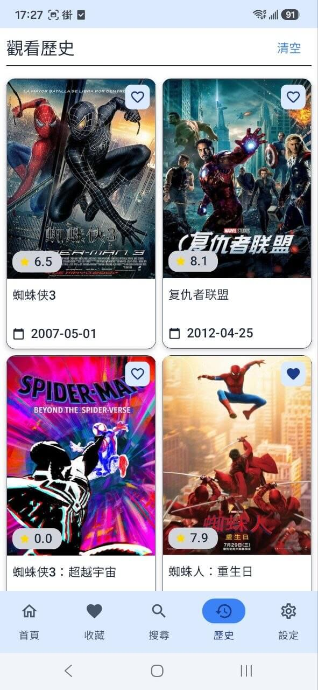 | 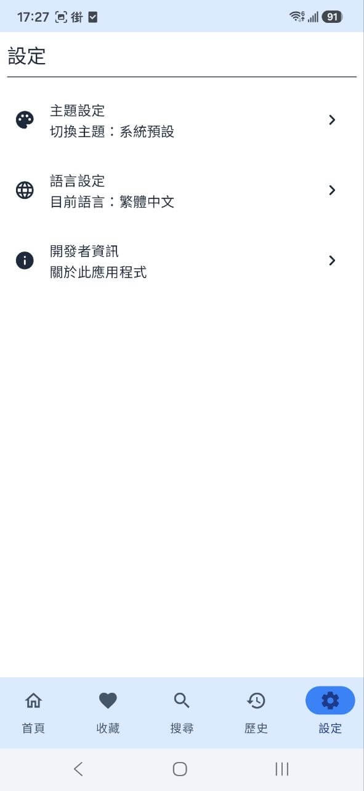 |

</details>

<details>
<summary><b>深色主題 (Dark Theme)</b></summary>

| 首頁 | 電影詳情 | 搜尋 |
| :---: | :---: | :---: |
| 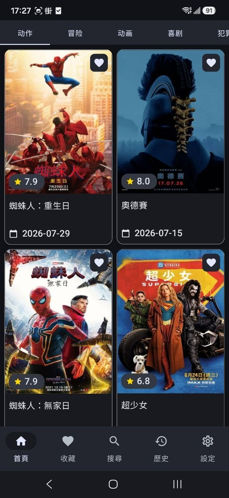 |  | 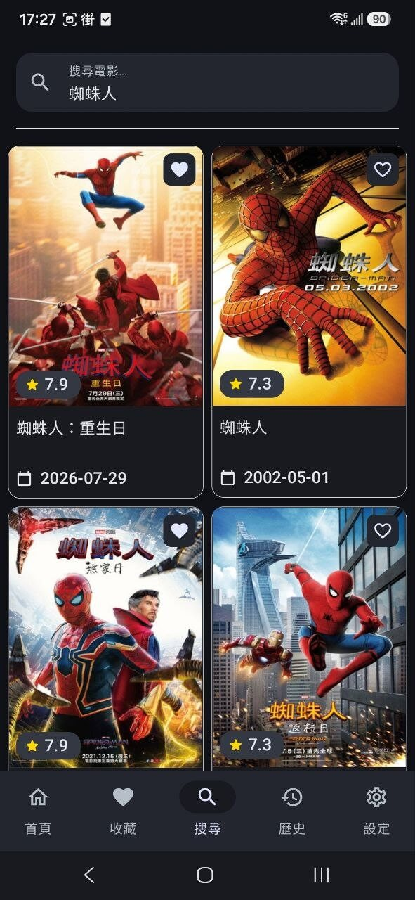 |

| 收藏清單 | 觀看歷史 | 設定頁 |
| :---: | :---: | :---: |
| 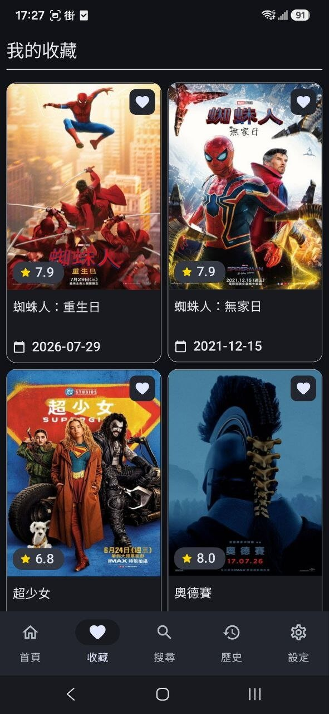 | 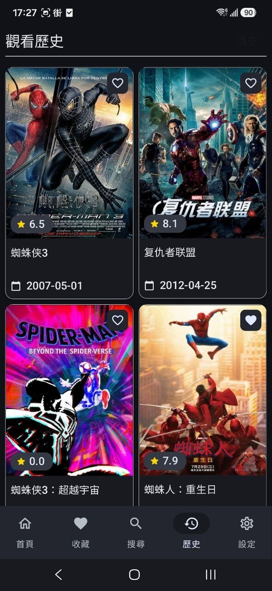 | 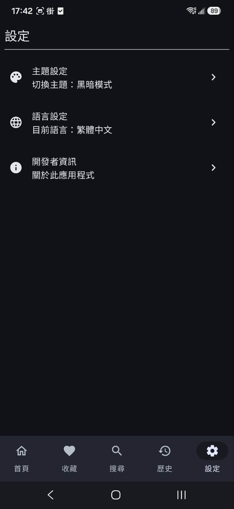 |

</details>

### iOS

<details open>
<summary><b>淺色主題 (Light Theme)</b></summary>

| 首頁 | 電影詳情 | 搜尋 |
| :---: | :---: | :---: |
| 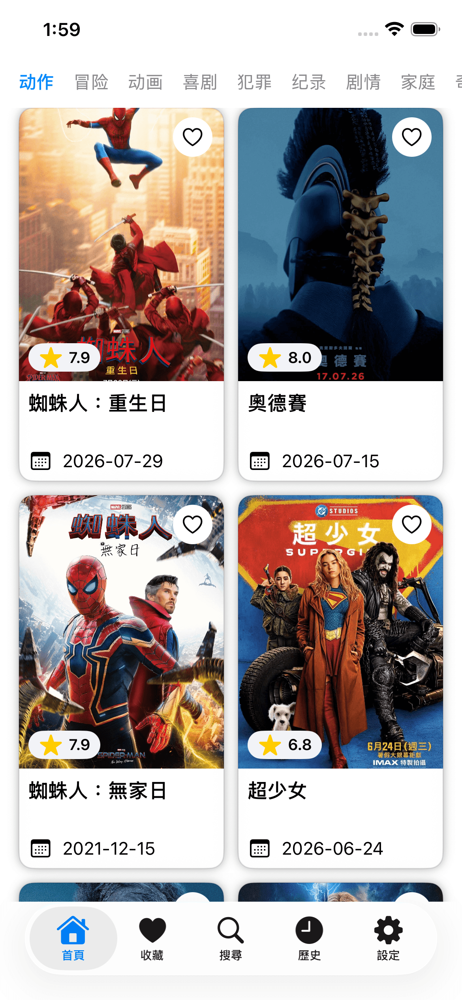 |  | 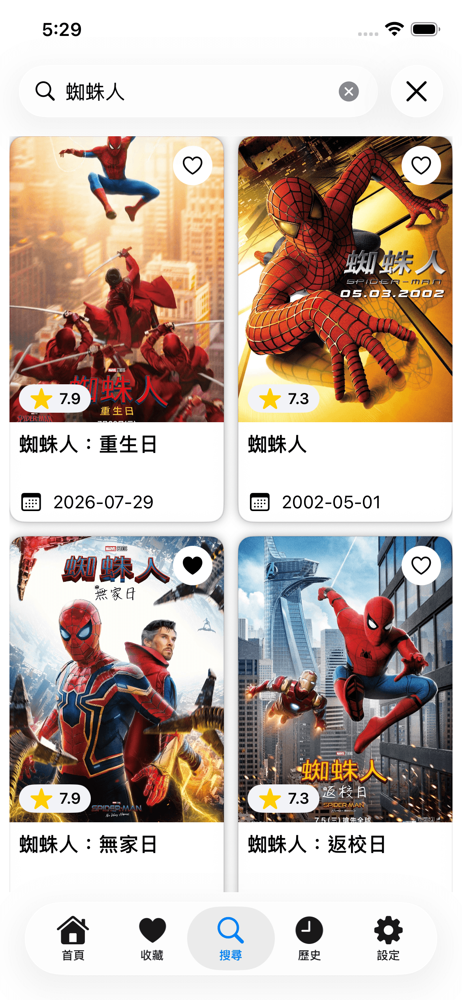 |

| 收藏清單 | 觀看歷史 | 設定頁 |
| :---: | :---: | :---: |
| 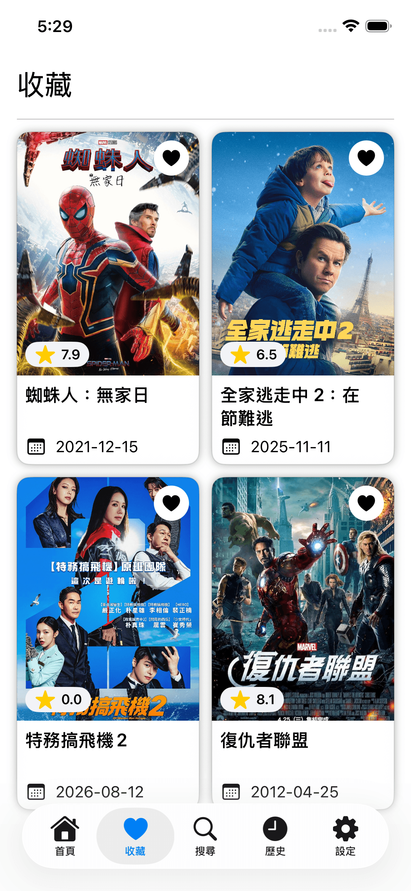 | 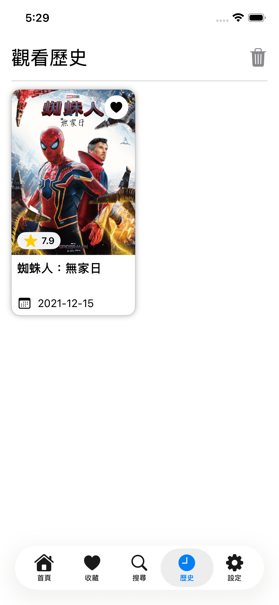 | 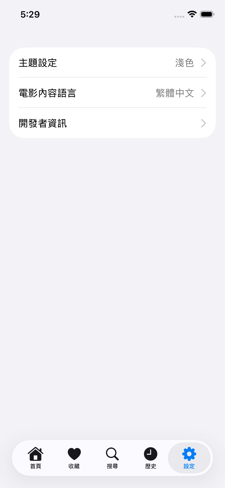 |

</details>

<details>
<summary><b>深色主題 (Dark Theme)</b></summary>

| 首頁 | 電影詳情 | 搜尋 |
| :---: | :---: | :---: |
| 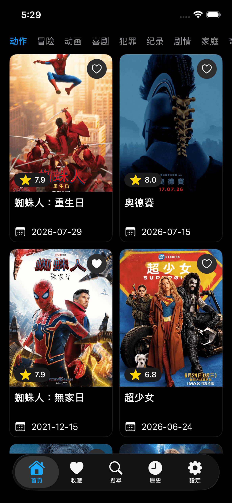 |  | 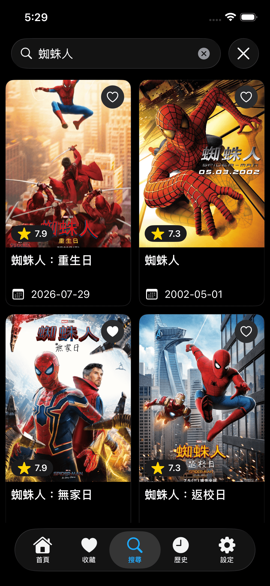 |

| 收藏清單 | 觀看歷史 | 設定頁 |
| :---: | :---: | :---: |
| 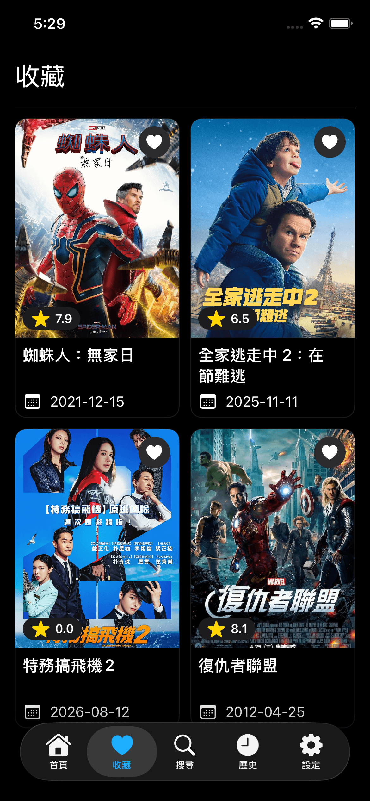 | 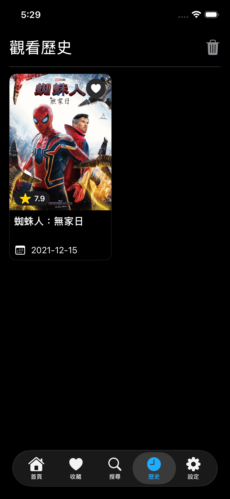 | 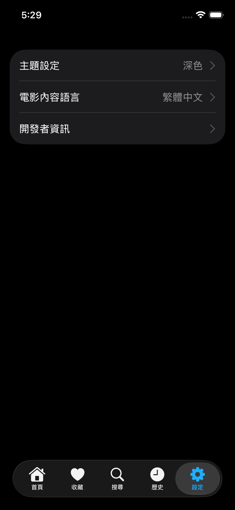 |

</details>

## 技術棧與關鍵函式庫 (Tech Stack & Key Libraries)

- **語言**：[Kotlin Multiplatform](https://kotlinlang.org/docs/multiplatform.html) — 共用業務邏輯，一份程式碼跑在 Android 與 iOS。
- **Android UI**：[Jetpack Compose](https://developer.android.com/jetpack/compose)。
- **iOS UI**：[SwiftUI](https://developer.apple.com/xcode/swiftui/)，透過 `shared/app` 產出的 `Shared` 靜態 framework 呼叫共用邏輯。
- **非同步處理**：[Coroutines](https://kotlinlang.org/docs/coroutines-overview.html) & [Flow](https://developer.android.com/kotlin/flow)。
- **架構**：多模組（Multi-module）+ Clean Architecture 分層 + MVVM。
- **依賴注入**：[Koin](https://insert-koin.io/) — 跨平台皆可使用的 KMP DI 框架。
- **網路請求**：[Ktor Client](https://ktor.io/docs/client.html)（Android 用 CIO engine、iOS 用 Darwin engine）。
- **資料庫**：[Room (KMP)](https://developer.android.com/kotlin/multiplatform/room) — 跨平台本地持久化儲存。
- **分頁載入**：[Paging 3](https://developer.android.com/topic/libraries/architecture/paging/v3-overview)。
- **偏好設定**：[DataStore](https://developer.android.com/topic/libraries/architecture/datastore)（KMP）。
- **圖片載入 (Android)**：[Coil 3](https://coil-kt.github.io/coil/)，並自訂 `HostInterceptor` 將 TMDB 相對路徑改寫成完整 CDN 網址，依用途（縮圖 / 詳情大圖）請求不同解析度。

## 專案架構 (Architecture)

本專案採 **KMP 多模組架構**：`shared/*` 存放跨平台共用的業務邏輯，UI 層則依平台各自實作原生介面（Android 用 Compose、iOS 用 SwiftUI），透過 `shared/app` 輸出的 `Shared` framework 串接。

- **`shared` 層**（Kotlin Multiplatform，Android 與 iOS 共用）：
  - `model`：純資料 model（`*Bean`、`UserData`、`ThemeMode`、`LanguageMode`）。
  - `common`：共用抽象（`NetworkException`、`BaseHostUrlProvider`、`LanguageProvider`、`JsonConfig`）。
  - `network`：Ktor client、TMDB API DataSource、`*Response` DTO。
  - `database`：Room（KMP）資料庫、DAO、Entity。
  - `datastore`：DataStore 偏好設定實作。
  - `data`：Repository 實作、Paging、Response → Bean 的 Mapper。
  - `domain`：UseCase，只依賴 `data`。
  - `app`：組裝層，統一註冊所有 Koin module；iOS framework（baseName `Shared`）由此輸出。
- **`core` 層**（Android-only）：
  - `designsystem`：Compose 元件庫（`JM*` 前綴元件，如 `JMAsyncImage`、`JMLazyVerticalGrid`）與主題。
  - `ui`：共用 Android UI（`MovieCard`、Paging LoadState UI、Coil `HostInterceptor`）。
- **`feature` 層**（Android-only，Compose 畫面）：`home`、`search`、`detail`、`collect`、`history`、`setting`。
- **`androidApp`**：Android 入口（`Application` 初始化 Koin、`MainActivity`、Navigation3）。
- **`iosApp`**：iOS 入口（Xcode 專案），內含各功能對應的 SwiftUI 畫面（`Home`、`Search`、`Detail`、`Favorites`、`History`、`Setting`），透過 `Shared` framework 呼叫 `domain` / `data` 層。

### 模組依賴圖

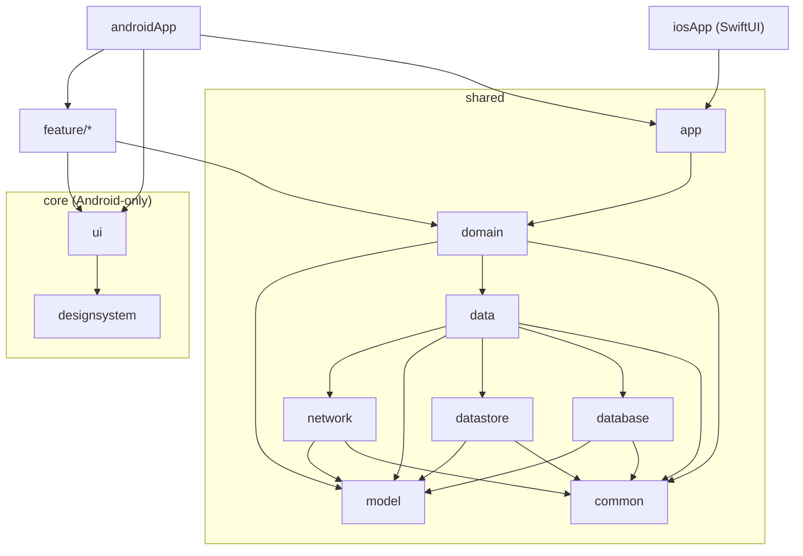

## 如何開始 (Getting Started)

### 1. Clone 專案

```bash
git clone https://github.com/CiaShangLin/JetpackMovieKMP.git
cd JetpackMovieKMP
```

### 2. 設定 API 金鑰

本專案需要 [TMDB API](https://www.themoviedb.org/signup) 金鑰才能取得電影資料。

1. 註冊 TMDB 帳號並申請 API Key。
2. 複製根目錄的 `key.properties.example` 為 `key.properties`。
3. 填入你的金鑰：

   ```properties
   TMDB_API_KEY=your_tmdb_api_key_here
   ```

   `key.properties` 已加入 `.gitignore`，不會進版控。`shared/network` 會透過 buildconfig plugin 產生 `BuildConfig.TMDB_API_KEY`。

### 3. 建置並執行 — Android

使用 Android Studio 開啟專案並點擊 Run，或使用 Gradle 指令：

```bash
# 在裝置 / 模擬器安裝 Debug 版本
./gradlew :androidApp:assembleDebug
./gradlew :androidApp:installDebug
```

### 4. 建置並執行 — iOS

> 需要 macOS + Xcode（含 Swift 工具鏈）。

1. 先在專案根目錄執行一次 Gradle，讓 `shared/app` 產出 iOS 需要的 `Shared.framework`（開啟 Xcode 專案時，Build Phase 會自動觸發此步驟，通常不需手動執行）。
2. 開啟 [`iosApp/iosApp.xcodeproj`](iosApp/iosApp.xcodeproj)。
3. 若需要在實機執行或送出簽章，於 [`iosApp/Configuration/Config.xcconfig`](iosApp/Configuration/Config.xcconfig) 填入你的 `TEAM_ID`。
4. 選擇模擬器或裝置，點擊 Run。

## 測試 (Testing)

- Android host 測試（JVM 上跑）：
  ```bash
  ./gradlew :shared:data:testAndroidHostTest
  ```
- 單一測試類別：
  ```bash
  ./gradlew :shared:data:testAndroidHostTest --tests "com.shang.jetpackmoviekmp.data.repository.MovieRepositoryImplTest"
  ```
- iOS simulator 測試：
  ```bash
  ./gradlew :shared:data:iosSimulatorArm64Test
  ```

以上指令中的 `:shared:data` 可替換成任一 shared 模組（`network`、`domain`、`database`、`datastore`、`app`…）。

## 程式碼風格與覆蓋率 (Code Style & Coverage)

```bash
# Kotlin 格式檢查 / 自動格式化（preBuild 會自動先跑一次）
./gradlew ktlintCheck
./gradlew ktlintFormat

# iOS Swift 格式檢查 / 自動格式化（需本機安裝 swiftformat、swiftlint）
./gradlew iosFormat
./gradlew iosFormatCheck
./gradlew iosLint
./gradlew iosCodeStyleCheck

# 完整驗證（含 ktlint，不含 iOS Swift lint）
./gradlew check

# data、network 模組的 80% 覆蓋率下限驗證（Kover）
./gradlew :shared:data:koverVerify :shared:network:koverVerify
```

iOS Swift 風格檢查需要 macOS + 已安裝 `swiftformat` / `swiftlint`；Windows 環境只能確認缺工具時的錯誤訊息夠清楚，完整檢查建議在 macOS 執行。

## CI/CD 持續整合與部署

本專案使用 **GitHub Actions**（[`.github/workflows/release-apk.yml`](.github/workflows/release-apk.yml)）自動化 Android 發布流程。

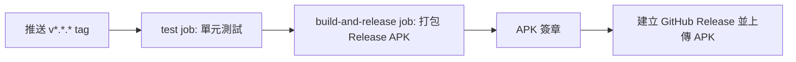

- 推送符合 `v*.*.*` 格式的 tag（或手動 `workflow_dispatch`）會觸發流程。
- `test` job 先跑 `testDebugUnitTest`、`testAndroidHostTest`，通過後才進入 `build-and-release` job。
- 只打包簽章後的 **APK**，不產出 AAB。
- iOS 目前沒有對應的自動化 CI 流程（待補：可考慮加入 `xcodebuild` 測試 / TestFlight 上傳流程）。

### 🔐 必要的 GitHub Secrets

| Secret 名稱 | 對應用途 |
|---|---|
| `TMDB_API_KEY` | 產生 CI 端的 `key.properties`，供 `shared/network` 讀取 |
| `KEYSTORE_BASE64` | Release 簽章 keystore 檔案的 base64 內容 |
| `KEYSTORE_PASSWORD` | 對應 `androidApp/build.gradle.kts` 讀取的環境變數 `storePassword` |
| `KEY_ALIAS` | 對應環境變數 `keyAlias` |
| `KEY_PASSWORD` | 對應環境變數 `keyPassword` |

CI 會把 `KEYSTORE_BASE64` 解碼寫入 `keystore/release.jks`，本機開發者也應把簽章檔放在同一路徑。

### Baseline Profile

`androidApp/src/main/baseline-prof.txt` 由本機手動生成後 commit 進 repo：透過 `:benchmark` 模組的 Macrobenchmark（`BaselineProfileGenerator`）在實機或模擬器上跑 instrumented test 產出。CI 不會自動重新生成，打包時只會使用 repo 內既有的檔案；若有重大導航或程式碼路徑變更，建議重新在本機生成一次並 commit。

## 📋 待辦事項 (TODO List)

- [ ] 補上 Medium 文章連結（目前為佔位連結）。
- [ ] 補上 iOS 對應的 CI/CD 流程（測試 / TestFlight）。
- [ ] 補上 License 授權條款與著作權人資訊。

歡迎提交 Issue / Pull Request 貢獻，包括新功能、Bug 修復、程式碼重構、文件改進、單元測試擴充。

## 授權 (License)

> 待補：目前 repo 尚未加入 `LICENSE` 檔案，以下僅為範例，請確認授權條款與著作權人後再補上。

```
Copyright 2026 Your Name

Licensed under the Apache License, Version 2.0 (the "License");
you may not use this file except in compliance with the License.
You may obtain a copy of the License at

    http://www.apache.org/licenses/LICENSE-2.0

Unless required by applicable law or agreed to in writing, software
distributed under the License is distributed on an "AS IS" BASIS,
WITHOUT WARRANTIES OR CONDITIONS OF ANY KIND, either express or implied.
See the License for the specific language governing permissions and
limitations under the License.
```

---

Learn more about [Kotlin Multiplatform](https://www.jetbrains.com/help/kotlin-multiplatform-dev/get-started.html)…
