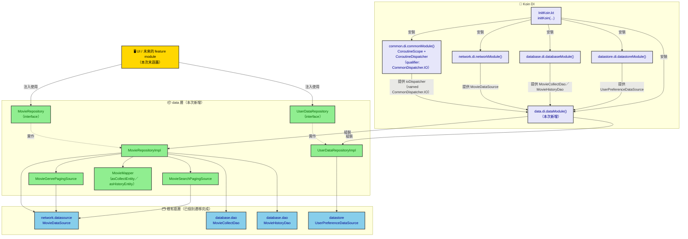

# migrate-data-to-commonmain 架構圖

對應 change：`openspec/changes/migrate-data-to-commonmain`。呈現新增的 `data` 層如何整合既有的
`network`／`database`／`datastore` 三層，以及 Koin DI 的組裝關係。

## 元件架構圖

## 說明

- **`data` 層（綠色）** 是本次變更新增的整合層，統一提供 `MovieRepository`／`UserDataRepository`
  給未來的 UI／feature module 使用，內部聚合三個已個別遷移完成的底層依賴（藍色）。
- **`MovieGenrePagingSource`／`MovieSearchPagingSource`** 只依賴 `MovieDataSource`（network），
  由 `MovieRepositoryImpl` 透過 `Pager` 組裝成 `Flow<PagingData<MovieCardResult>>`。
- **`CommonDispatcher.IO` qualifier**（紫色 `commonModule()`）是本次討論後新增的共用 DI 元件：
  `MovieRepositoryImpl` 的 `ioDispatcher` 建構子參數由 `dataModule()` 透過
  `get(qualifier = named(CommonDispatcher.IO))` 向 `commonModule()` 取得，而非寫死在
  `dataModule()` 內部，讓未來其他 module 也能重用同一個 IO dispatcher 綁定。
- **`InitKoin.kt`** 是兩平台（Android／iOS）共用的 Koin 啟動進入點，`dataModule()` 加入
  `modules(...)` 清單後即完成串接，不需要新增任何函式參數（`dataModule()` 沒有平台專屬邏輯）。
- 本次僅遷移到 `shared/commonMain`，不建立獨立 Gradle module（例如 `core:data`），因此圖中沒有
  獨立的 module 邊界，`data` 層與既有三層都位於同一個 `shared` module 之內。
