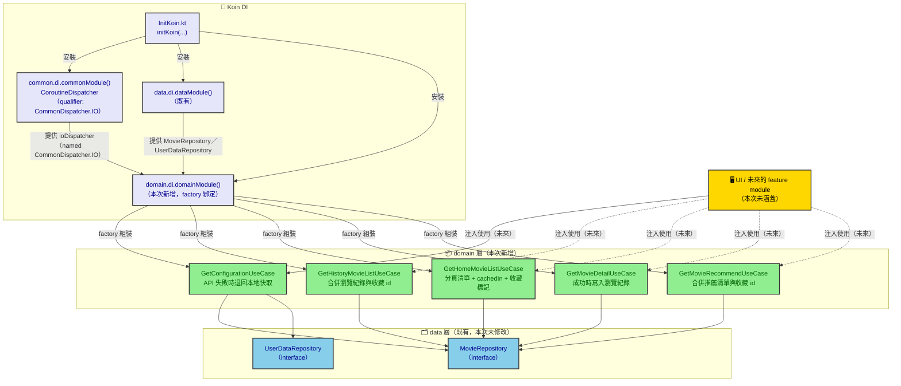

# migrate-domain-to-commonmain 架構圖

對應 change：`openspec/changes/migrate-domain-to-commonmain`。呈現新增的 `domain` 層如何整合既有的
`data` 層（`MovieRepository`／`UserDataRepository`），以及 Koin DI 的組裝關係。

## 元件架構圖

## 說明

- **`domain` 層（綠色）** 是本次變更新增的 UseCase 層，統一提供「已合併收藏狀態」「API 失敗自動退回
  快取」等業務邏輯給未來的 UI／feature module 使用，內部只依賴已遷移完成的 `data` 層（藍色）
  提供的 `MovieRepository`／`UserDataRepository` 介面，不重新碰 `network`／`database`／`datastore`
  這些更底層的元件（那些是更早的遷移，已經被 `data` 層整合過一次）。
- **5 個 UseCase 都只依賴 Repository 介面**：`GetConfigurationUseCase` 額外依賴
  `UserDataRepository`（讀寫本地快取的 configuration），其餘 4 個只依賴 `MovieRepository`。這種
  「只往下一層依賴、不跳過中間層」的設計維持了清楚的層級邊界，也讓 `domain` 層的測試只需要
  fake `MovieRepository`／`UserDataRepository` 兩個介面即可，不需要重新建立 network／database
  層的假物件。
- **Koin `domainModule()` 用 `factory`（紫色），不是 `data` 層慣用的 `single`**：5 個 UseCase
  都沒有內部可變狀態，純粹包裝 Repository 呼叫，`factory` 讓每次注入產生一個輕量的新實例，
  避免在多個呼叫端（例如不同 ViewModel）之間意外共用同一個 UseCase 物件；它們依賴的
  `MovieRepository`／`UserDataRepository`／`CoroutineDispatcher` 仍然是 `dataModule()`／
  `commonModule()` 提供的 `single`，所以底層資源不會被重複建立。
- **`CommonDispatcher.IO` qualifier** 沿用 `data` 層遷移時建立的共用 DI 元件，本次不修改
  `commonModule()`，5 個 UseCase 皆以必要建構子參數（無預設值）注入 `ioDispatcher`，由
  `domainModule()` 透過 `get(qualifier = named(CommonDispatcher.IO))` 向 `commonModule()` 取得。
- **`InitKoin.kt`** 是兩平台（Android／iOS）共用的 Koin 啟動進入點，`domainModule()` 加入
  `modules(...)` 清單後即完成串接，不需要新增任何函式參數（`domainModule()` 沒有平台專屬邏輯）。
- 本次僅遷移到 `shared/commonMain`，不建立獨立 Gradle module（例如 `core:domain`），因此圖中沒有
  獨立的 module 邊界，`domain` 層與既有 `data` 層都位於同一個 `shared` module 之內。
